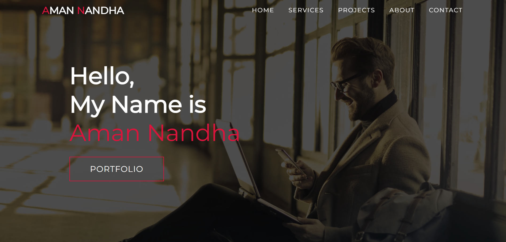

# One Page Portfolio Website



## Project Description

This is a one-page portfolio website showcasing the services offered, recent projects, and personal information. The website is designed to be responsive and user-friendly, providing a seamless experience across devices.

## Features

- Responsive design with smooth scrolling
- Sections for Services, Projects, About Me, and Contact Information
- Navigation menu for easy access to different sections
- Eye-catching visuals and animations

## Installation Instructions

1. Clone the repository:
   ```bash
   git clone https://github.com/amannandha007/portfolio.git
   ```
2. Navigate to the project directory:
   ```bash
   cd your-repo-name
   ```
3. Open `index.html` in your web browser to view the portfolio.

## Usage

- Navigate through the website using the menu.
- Explore the services offered and recent projects.
- Contact information is available for inquiries.

## Contributing

Contributions are welcome! Please feel free to submit a pull request or open an issue for any suggestions or improvements.

## License

This project is licensed under the MIT License.

## Contact Information

For any inquiries, please reach out to:

- Email: amannandhait7@gmail.com
- Phone: +91 7202089638
- [LinkedIn](www.linkedin.com/in/aman-nandha-513690264)
- [GitHub](https://github.com/amannandha007)

Made with ❤️ by [Aman Nandha](https://www.instagram.com/aman.nandha/)
